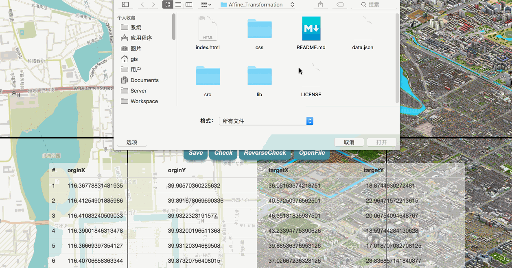

# Affine

Affine transformation by 2nd order polynomial

## Dependent JS

* [sylvester.js](http://sylvester.jcoglan.com/)
* [leaflet.js](http://leafletjs.com/)

## [Demo](https://bkgiser.github.io/Affine/)



## GetStart

```javascript

var mat = new MatrixCalc(Arr);

mat.to_target(x,y); //{x: targetX, y: targetY}

mat.to_orgin(x,y); // {x: oX, y: oY}

mat.A;  //transform parameter
mat.B;  //transform parameter
mat.C;  //transform parameter
mat.D;  //transform parameter
mat.E;  //transform parameter
mat.F;  //transform parameter


```


```javascript

//properties must be more than 7
var Arr = [
  {
    "from": [
      116.36778831481935,
      39.90570360225632
    ],
    "to": [
      36.05163574218751,
      -18.8744530272481
    ]
  },
  {
    "from": [
      116.41254901885986,
      39.891678069690336
    ],
    "to": [
      40.57250976562501,
      -22.96471572213615
    ]
  },...
]

```

## Why


> Affine transformation by 2nd order polynomial


When some online map too same but still has position difference, we could use this method find transform parameters,
and we could get where is different, I know every PC software could do this, but website more convenient, 
when we couldn't update online map, however we could update points. 

## License

MIT
